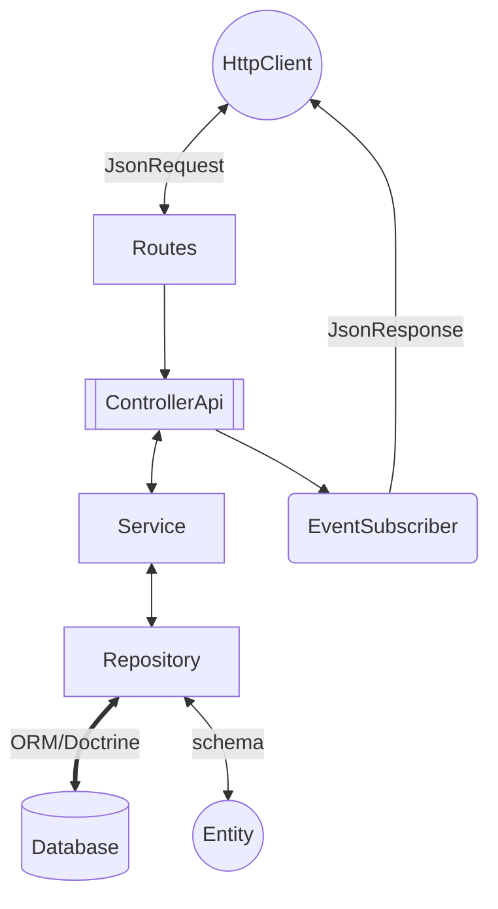
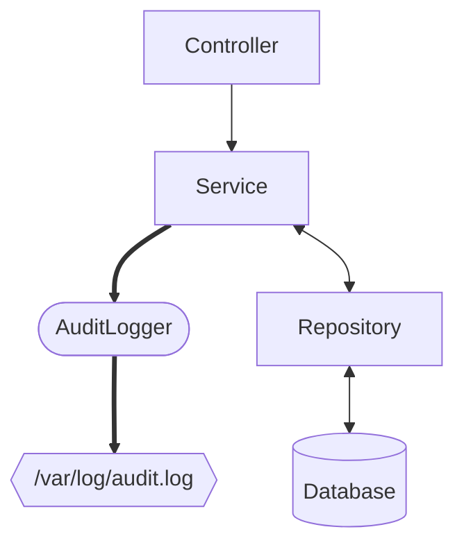

# Setup Symfony

Este é um repositório padrão para desenvolvimento de aplicações usando Docker, PHP, Symfony e MySQL

## Tecnologias

- **PHP** 8.4
- **MySQL** 8
- **Symfony** 7.2

## Instalação
<details>
<summary>Passo a passo</summary>

### Clonar o Repositório

Primeiro, clone o repositório usando SSH ou HTTPS:

```bash
git clone git@github.com:alessandrofeitoza/setup-symfony-docker.git
```
ou
```bash
git clone https://github.com/alessandrofeitoza/setup-symfony-docker.git
```

### Navegar para o Diretório do Projeto
Mude para o diretório do projeto:

```bash
cd setup-symfony-docker
```

---
>
> O jeito mais fácil é rodar o comando `make setup`, isso já vai executar todos os passos necessários e deixar a aplicação rodando em <http://localhost:8080>
>
Mas se preferir, pode fazer o passo a passo abaixo

---

### Iniciar o Docker com seus contêineres
Precisar ter o `docker compose` instalado/configurado:
```bash
docker compose up -d
```

### Instalar Dependências (Composer)
Antes de mais nada entre no contêiner PHP:
```bash
docker compose exec -it php bash
```
**Agora é necessário executar outros passos, sequencialmente:**

1 - Instalação das dependências do PHP:
```bash
composer install
```

2 - Executar as migrations do PostGres/Doctrine
```bash
php bin/console doctrine:migrations:migrate -n
```

3 - Executar as fixtures (dados falsos para testes) do banco de dados
```bash
php bin/console doctrine:fixtures:load -n
```


### Uso

Depois que tudo estiver configurado e as dependências instaladas, você pode acessar sua aplicação Symfony em [http://localhost:8080](http://localhost:8080).

</details>


## Desenvolvimento
<details>
<summary>Arquitetura e Decisões técnicas</summary>

Estamos utilizando o Symfony e o seu ecossistma de bibliotecas, porém a arquitetura é baseada em camadas e trata-se de um monolítico com a metodologia API First




#### Logs
Estamos salvando os logs de cada persistencia na base, optamos por fazer esse controle através da camada `Service`, como mostra a figura a seguir:



#### Response Headers
Através de uma camada de `EventSubscriber` estamos adicionando um custom header em cada Response

<table>
<tr>
<th colspan="2">HEADERS</th>
</tr>
<tr>
<td>X-REQUEST-INFO</td>
<td>2</td>
</tr>
</table>

</details>

